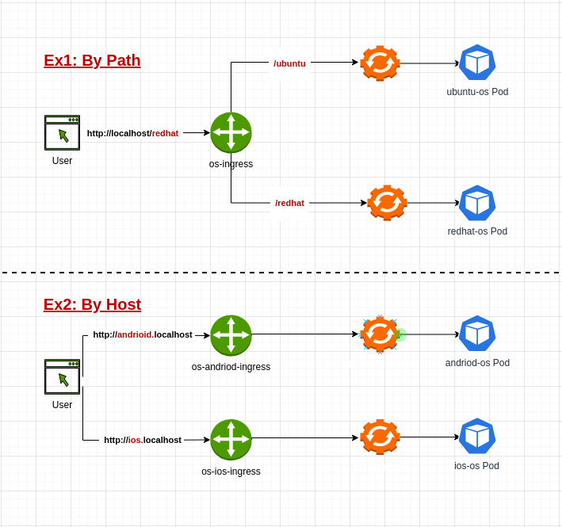

# Installing Kind

> In this lab we are going to setup kind cluster (3 nodes) with ingress nginx to pusblish the pods to public access , we will also create some examples that use ingress nginx.

## Prerequisites
  1. First install the [Docker Engine](https://github.com/genral73/docker#install-docker-engine-on-ubuntu-or-debian), then come back here for instructions install kind.
  2. Make sure you have kubectl installed. You can install kubectl according to the instructions in [Install and Setup kubectl.](https://github.com/genral73/k8s-cli#install-setup-and-overview-kubectl)	
  3. clone this repository on your laptop to execute the instructions
   ```bash
   git clone https://github.com/genral73/k8s-kind.git
   cd k8s-kind
   ```
<br/>

## Step 1: Download and install kind binary
```bash
curl -Lo ./kind  https://kind.sigs.k8s.io/dl/v0.8.1/kind-$(uname)-amd64
chmod +x ./kind
mv ./kind /usr/local/bin/kind
```

## Step 2: Creating and interact the cluster

1. Create a Kubernetes cluster using kind create cluster (this may take 4-5 mins):
```bash
kind create cluster  --image kindest/node:v1.18.0 --name kind01 --config kind-config-ingress.yaml
docker ps

Output:  
e201cf92416b  kindest/node:v1.18.0  "/usr/local/bin/entr…"  0.0.0.0:80->80/tcp, 0.0.0.0:443->443/tcp, 127.0.0.1:32770->6443/tcp   kind01-control-plane
07c139864e35  kindest/node:v1.18.0  "/usr/local/bin/entr…"  kind01-worker
bf7f67675958  kindest/node:v1.18.0  "/usr/local/bin/entr…"  kind01-worker2
```

2. To run the cluster autostartuo on boot by using:
```bash
docker update --restart=always e201cf92416b
docker update --restart=always 07c139864e35
docker update --restart=always bf7f67675958
```

3. After creating a cluster, you can use kubectl to interact with it by using:
```bash
kind get clusters
kubectl cluster-info --context kind-kind01
```

4. To delete te kind01 cluster use:
```shell
docker stop kind01-control-plane kind01-worker kind01-worker2
docker rm kind01-control-plane kind01-worker kind01-worker2
kind delete cluster
```

## Step 3: Enabling the ingress/nginx by apply this file inro kind cluster
```bash
kubectl apply -f ingress-nginx.yaml
```


## Step 4: Verify and deploy examples on kind cluster
Verify that kind cluster is installed correctly by creating examples, we have 2 examples uses the [hashicorp/http-echo](https://hub.docker.com/r/hashicorp/http-echo) image just print text when are access the pod throurg path or host-subdomain of serveice.
  
 
<br/>

#### Example 1: Access to service by using the path like [ /ubuntu or /redhat ] 
1. Apply the yaml file to deploy the pods, services and ingress resources:
```bash
kubectl apply -f ingress-examples/os-path.yaml
```

2. Open the broswer and write:
  - http://localhost/ubuntu  ->  should output "Welcome To Ubnutu OS"   
  
  - http://localhost/redhat  ->  should output "Welcome To Redhat OS"


<br/>

#### Example 2: Access to service by using the host or subdomain like [ http://ios.localhost ] 
1. Apply the yaml file to deploy the pods, services and ingress resources:
```bash
kubectl apply -f ingress-examples/os-subdomain.yaml
```

2. Open the broswer and write:
  - http://andriod.localhost  ->  should output "Welcome To Andriod OS"
      
  - http://ios.localhost      ->  should output "Welcome To ios OS"


